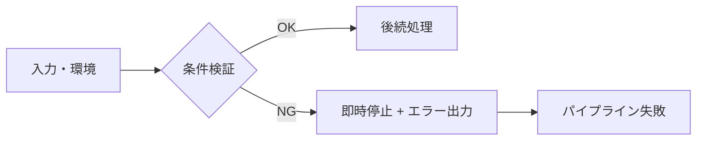
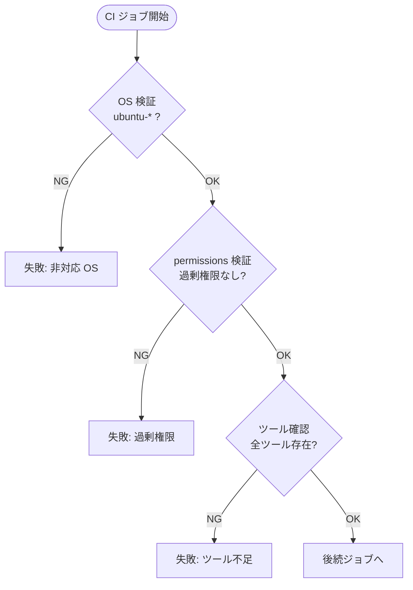

## ゲートパターン

ci-platform では、CI パイプラインに**ゲートパターン**を採用しています。
ゲートパターンとは、処理の開始前に前提条件を検証し、条件を満たさない場合は即座に停止する fail-fast な設計手法です。

---

## 🚦 ゲートパターンとは

ゲートパターンは次の 3 原則で構成されます。

<!-- textlint-disable ja-hiraku -->

**エントリ条件の明示**: 処理を開始するために満たすべき条件を明示的に定義する。

**検証の即時実行**: パイプラインの最初のステップで条件を検証し、後続処理を実行する前に合否を判断する。

**即時停止**: 条件を満たさない場合は後続のすべてのステップを実行せずに停止する。

<!-- textlint-enable ja-hiraku -->

ゲートパターンにより、**問題のある環境では処理が進まない**ことが保証されます。
後続ステップが不完全な環境で実行されることによる誤検知・副作用を防止します。

---

## 🏗️ ゲートの構造



<!-- textlint-disable ja-hiraku -->

**ゲートの構成要素**:

- **入力**: 実行環境 (OS・権限・ツール) または処理対象のデータ
- **条件検証**: 各入力が期待値を満たしているかを検査するロジック
- **OK パス**: 全条件クリア時に後続処理へ移行
- **NG パス**: 条件未達時にエラーメッセージを出力して即時停止

<!-- textlint-enable ja-hiraku -->

---

## 🔍 validate-environment: ゲートパターンの実装例

`validate-environment` は ci-platform が提供するゲートパターンの実装例です。
CI パイプラインの先頭に配置し、実行環境の妥当性を 3 段階で検証します。

### 3 段ゲートの構成

<!-- markdownlint-disable line-length MD060 -->

| ゲート番号 | 検証項目         | 内容                                           | 失敗時の動作         |
| ---------- | ---------------- | ---------------------------------------------- | -------------------- |
| Gate 1     | OS 検証          | Linux ランナー (ubuntu-*) であることを確認     | 即時失敗・後続停止   |
| Gate 2     | permissions 検証 | `contents: write` など過剰権限がないことを確認 | 即時失敗・後続停止   |
| Gate 3     | ツール確認       | 必要なツールがランナーに存在することを確認     | 即時失敗・後続停止   |

<!-- markdownlint-enable line-length MD060 -->

### フロー図



### 利用例

```yaml
jobs:
  validate:
    runs-on: ubuntu-latest
    permissions:
      contents: read
    steps:
      - uses: aglabo/ci-platform/.github/actions/validate-environment@v0.1.0
      # validate-environment が OK の場合のみ後続ステップが実行される
      - name: Run scan
        run: actionlint ...
```

---

## 📐 ゲートの配置ルール

<!-- textlint-disable ja-hiraku -->

**CI パイプラインの最初のステップに配置する**:

ゲートは後続ステップを守るために存在するため、必ずパイプラインの先頭に配置します。
後続ステップの後にゲートを置いても意味がありません。

**1 検証 = 1 責務**:

1 つのゲートは 1 つの検証責務のみを持ちます。
OS 検証とツール確認を 1 ステップに混在させず、それぞれ独立したゲートとして実装します。

**エラーメッセージは問題と修正方法を明示する**:

ゲートが失敗した場合、開発者が何を修正すべきかを明確に伝えるエラーメッセージを出力します。

<!-- textlint-enable ja-hiraku -->

---

## ✅ 新しいコンポーネント追加時のゲート適用

新しい Composite Action または Reusable Workflow を追加する際は、次のチェックリストに従ってゲートを適用してください。

<!-- textlint-disable ja-hiraku -->

- [ ] `validate-environment` を最初のステップとして配置しているか
- [ ] 必要なツールが `validate-environment` のツール確認リストに含まれているか
- [ ] 権限要件が `contents: read` の最小権限に収まっているか
- [ ] 追加が必要な場合、`contents: write` 等の追加権限に明確な理由があるか
- [ ] ゲートが失敗した場合に後続ステップが実行されない設計になっているか

<!-- textlint-enable ja-hiraku -->

---

## 📚 次のステップ

- [アーキテクチャ](./03-architecture.ja.md): ゲートパターンが組み込まれた CI/CD フロー全体像
- [セキュリティモデル](./05-security-model.ja.md): ゲートパターンを支えるセキュリティ設計
