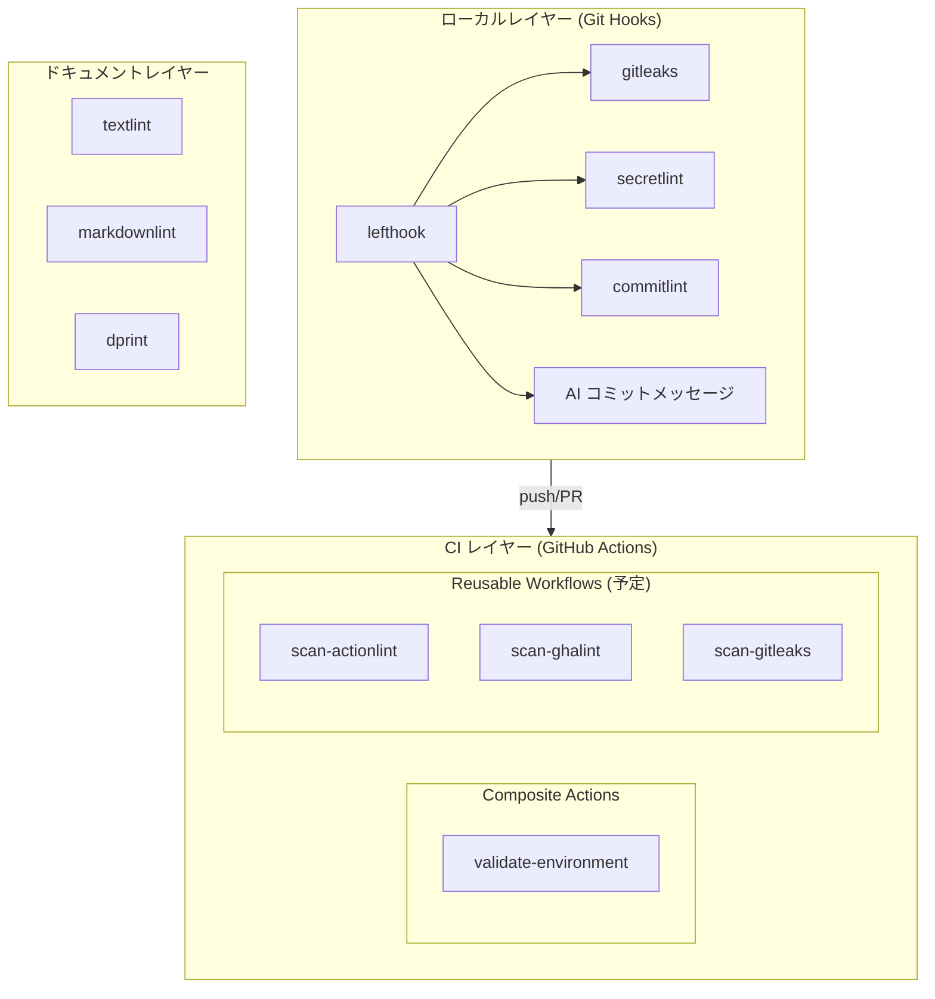
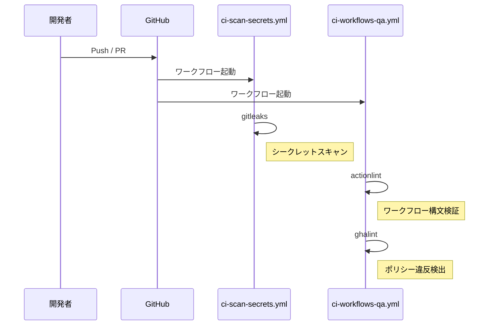
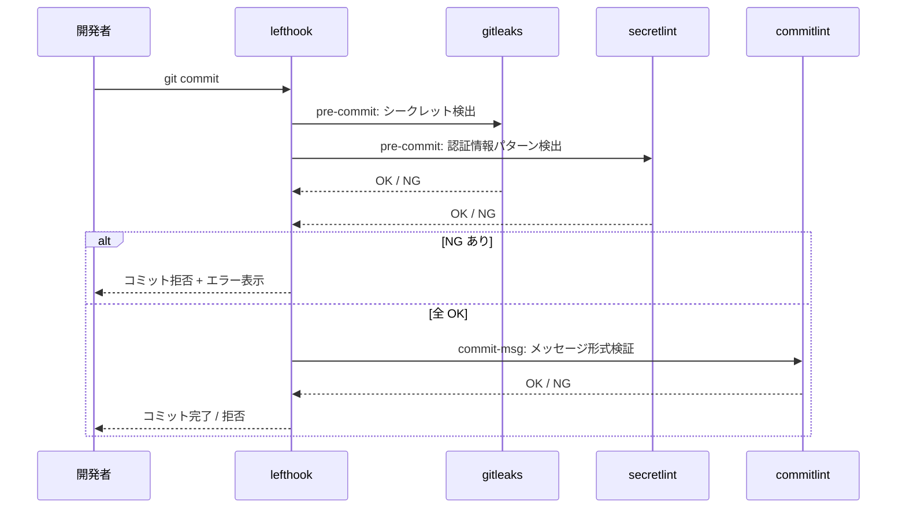

## アーキテクチャ

ci-platform のコンポーネント構成・ディレクトリ構造・各フローを解説します。

---

## 🏗️ コンポーネント構成

ci-platform は 3 つのレイヤーで構成されています。



---

## 📁 ディレクトリ構造

```
ci-platform/
├── .github/
│   ├── actions/
│   │   └── validate-environment/   # Composite Action
│   │       └── action.yml
│   └── workflows/
│       ├── ci-scan-secrets.yml     # 機密情報スキャン
│       └── ci-workflows-qa.yml     # ワークフロー QA
├── configs/                        # 品質ツール設定
│   ├── actionlint.yaml
│   ├── ghalint.yaml
│   ├── gitleaks.toml
│   ├── secretlint.config.yaml
│   ├── .markdownlint.yaml
│   └── textlintrc.yaml
├── scripts/                        # 開発スクリプト
│   ├── run-specs.sh                # ShellSpec 実行ラッパー
│   ├── setup-dev-env.sh            # 開発環境セットアップ
│   ├── prepare-commit-msg.sh       # AI コミットメッセージ生成
│   └── __tests__/                  # ShellSpec テスト
├── docs/                           # Docusaurus ドキュメント
│   ├── user-guide/
│   └── developer-guide/
├── lefthook.yml                    # Git Hooks 定義
└── package.json
```

---

## 🔄 CI/CD フロー

Push または PR 時に `ci-scan-secrets.yml` と `ci-workflows-qa.yml` が並行して実行されます。



### validate-environment の役割

`validate-environment` は CI パイプラインの**強制停止ゲート**です。
次の 3 つを検証し、いずれかが失敗した場合は即座に後続ジョブを停止します。

<!-- markdownlint-disable line-length MD060 -->

| 検証項目         | 内容                                           |
| ---------------- | ---------------------------------------------- |
| OS 検証          | Linux ランナー (ubuntu-*) であることを確認     |
| permissions 検証 | `contents: write` など過剰権限がないことを確認 |
| ツール確認       | 必要なツールがランナーに存在することを確認     |

<!-- markdownlint-enable line-length MD060 -->

---

## 🪝 Git Hooks フロー

lefthook が Git イベントに応じて品質チェックを自動実行します。



---

## 🔗 コンポーネント間の関係

### 設定ファイルと各コンポーネントの対応

<!-- markdownlint-disable line-length MD060 -->

| 設定ファイル                     | 参照コンポーネント              |
| -------------------------------- | ------------------------------- |
| `configs/gitleaks.toml`          | gitleaks (CI + Git Hooks)       |
| `configs/secretlint.config.yaml` | secretlint (Git Hooks)          |
| `configs/actionlint.yaml`        | actionlint (CI)                 |
| `configs/ghalint.yaml`           | ghalint (CI)                    |
| `configs/textlintrc.yaml`        | textlint (ドキュメント品質)     |
| `configs/.markdownlint.yaml`     | markdownlint (ドキュメント品質) |
| `lefthook.yml`                   | lefthook (Git Hooks 全体定義)   |

<!-- markdownlint-enable line-length MD060 -->

### 外部リポジトリからの参照方式

利用者のリポジトリは ci-platform を**バージョン固定で参照**します。
ci-platform のリポジトリをフォークする必要はありません。

```yaml
# 利用者のワークフロー例
steps:
  - uses: aglabo/ci-platform/.github/actions/validate-environment@v0.1.0
```

---

## 📚 次のステップ

- [デザインプリンシプル](./04-design-principles.ja.md): アーキテクチャを支える設計原則と実装方針
- [GitHub Actions 設計](./30-github-actions.ja.md): Composite Action / Reusable Workflow の詳細
- [スクリプトリファレンス](./20-scripts-reference.ja.md): scripts/ 配下の詳細リファレンス
