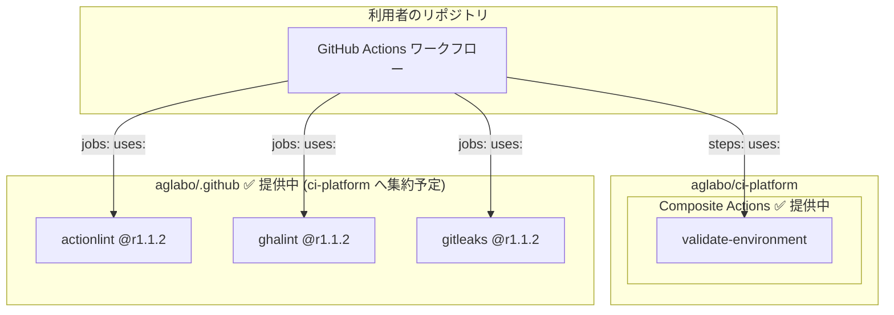

<!-- markdownlint-disable line-length -->

## 🏗️ ci-platform とは

`ci-platform` は、**複数の OSS リポジトリにわたる CI/CD を統制・管理するための基盤**です。
CI セキュリティポリシーを単一リポジトリで一元管理し、各リポジトリへ外部化・強制します。

CI 設定を各リポジトリへコピーして運用していると、次のような問題が起きがちです。

- リポジトリごとに設定内容が少しずつ異なり、セキュリティポリシーが統一されなくなる
- パーミッションや検証ルールの変更を、すべてのリポジトリへ個別に反映する必要がある
- どのリポジトリが最新のポリシーに追いついているか把握できなくなる

`ci-platform` はこれらの問題を、CI 設定を外部リポジトリに集約して参照する構造で解決します。

**対象読者**:

- 複数リポジトリにわたって CI/CD を標準化したい OSS メンテナー
- GitHub Actions のセキュリティポリシー (権限・ランナー・シークレット) を組織全体で強制したい
- ワークフロー設定のドリフトとサプライチェーンリスクを構造的に排除したい

GitHub Actions の Composite Action と Reusable Workflow を SHA 固定で参照するだけで利用できます。

```yaml
- uses: aglabo/ci-platform/.github/actions/validate-environment@21e02575bb3c3ec61a149801d696b53669f85208 # v0.1.0
```

> **クイックスタートはこちら** → [最小構成で今すぐ導入](./11-quickstart.ja.md)

---

## 🎯 解決する問題

| 問題                                               | ci-platform のアプローチ                            |
| -------------------------------------------------- | --------------------------------------------------- |
| CI 設定を各リポジトリにコピーしていて管理が分散    | Actions/Workflows を外部リポジトリに集約して参照    |
| パーミッション不足・ランナー不正が CI 実行後に判明 | `validate-environment` でジョブ冒頭に fail-fast     |
| サプライチェーン攻撃への耐性が不明確               | SHA 固定 + タグコメントを標準的な参照方式として採用 |
| シークレット漏洩を CI で検知したい                 | gitleaks Reusable Workflow による全コードスキャン   |

> **典型的なリスクシナリオ**:
>
> - fork PR が `pull_request_target` のコンテキストで実行され、シークレットへアクセスされる
> - `permissions:` が未設定のまま default permissions が有効になり、書き込み権限が意図せず付与される
> - タグ書き換えによって参照先 Action のコードが静かに差し替えられるサプライチェーン攻撃
>
> ci-platform はこれらのリスクをポリシーとして構造的に排除します。

---

## 📦 提供コンポーネント

### Composite Action (`aglabo/ci-platform`)

| コンポーネント         | 役割                                                                                                     |
| ---------------------- | -------------------------------------------------------------------------------------------------------- |
| `validate-environment` | **CI 冒頭に置くゲート**。ランナー OS・パーミッション・ツールを検証し、ポリシー違反を即座にブロックします |

Composite Action は `steps:` から参照します。ジョブ内で fail-fast として機能します。

### Reusable Workflow (`aglabo/.github`)

| コンポーネント | 役割                                  | 参照パス (`@r1.1.2`)                                             |
| -------------- | ------------------------------------- | ---------------------------------------------------------------- |
| actionlint     | GitHub Actions ワークフローの構文検証 | `aglabo/.github/.github/workflows/ci-common-lint-actionlint.yml` |
| ghalint        | GitHub Actions のポリシー違反検出     | `aglabo/.github/.github/workflows/ci-common-lint-ghalint.yml`    |
| gitleaks       | リポジトリ全体の機密情報スキャン      | `aglabo/.github/.github/workflows/ci-common-scan-gitleaks.yml`   |

Reusable Workflow は `jobs:` から参照します。複数ジョブ・複数リポジトリにわたるポリシーを強制します。

> Reusable Workflow は現在 `aglabo/.github` リポジトリから提供されており、将来的に `ci-platform` へ集約予定です。

### 二層防御モデル

ci-platform は次の 2 層でリポジトリを保護します。

- 第 1 層 (ジョブ内): Composite Action がステップ冒頭で環境を検証し、ポリシー違反を即座にブロックします
- 第 2 層 (ワークフロー全体): Reusable Workflow がリポジトリ横断でセキュリティポリシーを強制します

この組み合わせにより、「実行前の即時検出」と「組織全体の一貫した適用」を同時に達成します。

```plaintext
┌─────────────────────────────────────────────────────────────────┐
│ 利用者のワークフロー                                            │
│                                                                 │
│  jobs:                                                          │
│    lint:                                                        │
│      uses: aglabo/.github/...actionlint.yml@r1.1.2  ← Reusable  │
│                                                                 │
│    build:                                                       │
│      steps:                                                     │
│        - uses: aglabo/ci-platform/.../validate-environment@SHA  │
│          ← Composite (ジョブ内 fail-fast ゲート)                │
└─────────────────────────────────────────────────────────────────┘
```

| 種別              | 参照場所 | スコープ     | 目的                    |
| ----------------- | -------- | ------------ | ----------------------- |
| Composite Action  | `steps:` | ジョブ内     | 実行前の fail-fast 検証 |
| Reusable Workflow | `jobs:`  | ワークフロー | CI 全体へのポリシー強制 |

### 構成概観



---

## 🔒 SHA 固定による参照

ci-platform では **SHA 固定 + タグコメント**を標準的な参照方式として採用しています。

```yaml
# 推奨: SHA 固定でサプライチェーン攻撃への耐性を確保
- uses: aglabo/ci-platform/.github/actions/validate-environment@21e02575bb3c3ec61a149801d696b53669f85208 # v0.1.0
```

タグ (`@v0.1.0`) だけでは参照先のコミットが後から書き換えられるリスクを排除できません。
SHA 固定により、参照先の内容が変更されても CI への影響をゼロに抑えられます。

> **SHA の更新戦略**: Dependabot または Renovate の `github-actions` エコシステム設定で
> SHA を自動更新できます。タグコメント (`# v0.1.0`) が付いていれば PR で差分を確認できます。

---

## 🖥️ 実行環境

**Linux ランナー専用** (`ubuntu-latest` / `ubuntu-22.04` など)。

検証スクリプトは Bash と GNU ツールに依存しており、macOS・Windows ランナーはサポート対象外です。

---

## ⚙️ 設計原則とスコープ

### 設計原則

| 原則                    | 内容                                                                                   | 具体例                                                                     |
| ----------------------- | -------------------------------------------------------------------------------------- | -------------------------------------------------------------------------- |
| Immutable reference     | SHA 固定により、参照先コミットが変わらない限り CI は影響を受けない                     | `@21e02575...` のようにフル SHA で固定する                                 |
| Centralized enforcement | セキュリティポリシーを単一リポジトリで一元管理し、各リポジトリ間の設定のずれを防ぎます | `permissions:` ポリシーを ci-platform 側で定義し、全リポジトリから参照する |
| Fail early, fail loudly | `validate-environment` がジョブ冒頭でポリシー違反を即検出・即終了する                  | ランナー OS が `ubuntu` でなければ最初のステップで即 `exit 1`              |

### このプラットフォームが扱わないもの

- CI テンプレートの自動生成
- 独自ランナーの管理・プロビジョニング
- アプリケーションのデプロイ戦略

### なぜ専用リポジトリなのか

GitHub `.github` リポジトリでも Org 共通設定は可能ですが、`ci-platform` は意図的に独立したリポジトリとして管理しています。

- バージョン管理の独立性: CI 基盤の変更が全リポジトリに波及するタイミングを明示的に制御できる
- SHA 固定による改ざん耐性: 参照元コミットが変わらない限り、利用者の CI は影響を受けない
- 段階的な拡張: Composite Action から Reusable Workflow へ、スコープを拡大しながら展開できる

各リポジトリは独自のジョブを自由に追加できます。ci-platform は CI の「禁止」ではなく「境界の定義」です。

---

## 🗺️ 現在の実装状況

**v0.1.x**: `validate-environment` Composite Action を提供中。

actionlint・ghalint・gitleaks の Reusable Workflow は `aglabo/.github` リポジトリ (`@r1.1.2`) から提供されています。
ci-platform 自身の CI でも使用しており、将来的に `ci-platform` リポジトリへ集約予定です。

```yaml
# Reusable Workflow の利用例
jobs:
  scan-secrets:
    uses: aglabo/.github/.github/workflows/ci-common-scan-gitleaks.yml@r1.1.2
```

**段階導入パターン**:

1. **検証フェーズ**: `validate-environment` を 1 ジョブに追加し、既存 CI に影響を与えずに動作を確認します
2. **拡大フェーズ**: Reusable Workflow を新規ジョブとして追加します (既存ジョブは変更しません)
3. **標準化フェーズ**: 全ジョブに `validate-environment` を配置し、ポリシー適用を完了させます

> Breaking Change 対応: SHA 固定または版タグで参照を固定しているため、
> アップグレードは任意のタイミングで実施できます。

---

## 📚 関連ドキュメント

- [使い方](./01-how-to-use.ja.md): 各種アクション・ワークフローの利用手順
- [クイックスタート](./11-quickstart.ja.md): 最小構成での導入手順
- [Validate Environment 概要](./10-about-validate-environment.ja.md): validate-environment の詳細
