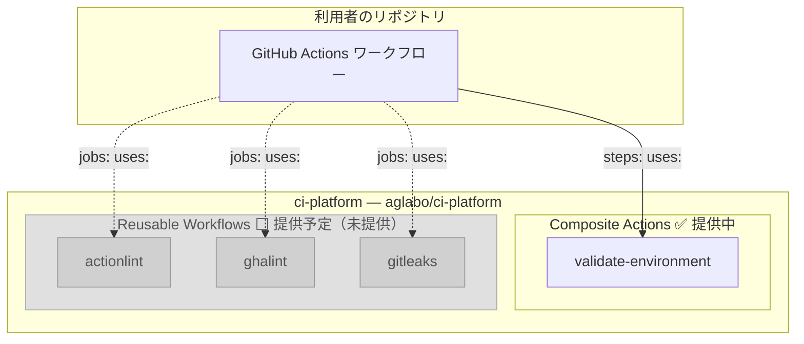

## 🏗️ ci-platform とは

`ci-platform` は、OSS の **CI/CD 品質管理を共通化・外部化するための基盤**です。
CI の入口を標準化し、セキュリティポリシーを組織横断で強制できる「ゲート基盤」として設計されています。

次のような開発者・チームに向けて設計しています。

- 複数の OSS リポジトリを運営しており、CI 設定を毎回コピーしている
- GitHub Actions のセキュリティポリシーを組織横断で標準化したい
- ワークフロー設定のミスやシークレット漏洩をコミット前後で防ぎたい

GitHub Actions の Composite Actions や Reusable Workflows を公開しています。
自分のリポジトリのワークフローから `aglabo/ci-platform` を指定して `uses:` で参照するだけで利用できます。

```yaml
- uses: aglabo/ci-platform/.github/actions/validate-environment@v0.1.0
```

---

## 🎯 解決する問題

OSS 開発では、CI/CD に関して次のような課題が生じやすいです。

- コミット時にシークレット情報や機密データを混入するリスクがある
- GitHub Actions ワークフローの設定ミスが CI 実行時まで発覚しない

`ci-platform` が公開する Actions やワークフローを参照することで、これらの問題に対処する CI/CD 品質管理の仕組みを**自分のリポジトリに取り込めます**。

## 🖥️ 実行環境

ci-platform は Linux ランナー (Ubuntu) を前提として設計されています。
シェルベースの検証ロジックおよび GNU ツール依存のため、Linux ランナーに限定しています。
macOS および Windows ランナーはサポート対象外です。

---

## 📦 提供コンポーネント

### 現在提供中

<!-- markdownlint-disable line-length no-inline-html -->

| 種類             | コンポーネント       | レイヤー           | 役割                                                                                                                     |
| ---------------- | -------------------- | ------------------ | ------------------------------------------------------------------------------------------------------------------------ |
| Composite Action | validate-environment | エントリーポイント | **CI の最初に置くゲートアクション**。<br />ランナーの OS・パーミッション・ツールを検証し、後続ジョブへの進入を制御します |

<!-- markdownlint-enable line-length no-inline-html -->

> `validate-environment` は CI パイプラインの**強制停止ゲート**として機能します。
> ポリシー違反・権限不足・ランナー不正を検出した時点で即座に停止し、後続ジョブへの進入を遮断します。

### 提供予定 (Reusable Workflow)

<!-- markdownlint-disable line-length MD060 -->

| コンポーネント | 説明                                  |
| -------------- | ------------------------------------- |
| actionlint     | GitHub Actions ワークフローの構文検証 |
| ghalint        | GitHub Actions のポリシー違反検出     |
| gitleaks       | リポジトリ全体の機密情報スキャン      |

<!-- markdownlint-enable line-length MD060 -->

> 上記のツールは現在 ci-platform 自身の CI で使用しています。
> v0.2.x では actionlint / ghalint / gitleaks をそれぞれ独立した Reusable Workflow
> (`scan-actionlint.yml` など) として提供します。
> 利用者は必要なツールのみ選択して参照できます。

### 構成概観



> 実線は現在提供中、点線は提供予定のコンポーネントです。

## 🔧 品質管理の 3 つの柱

OSS 開発における品質管理は、次の 3 つの領域に分けられます。

| 領域                 | 対象               | ci-platform での提供 |
| -------------------- | ------------------ | -------------------- |
| ローカル品質管理     | Git Hooks          | 対象外               |
| **CI/CD 品質管理**   | **GitHub Actions** | **提供中・提供予定** |
| ドキュメント品質管理 | textlint など      | 対象外               |

**ci-platform が提供するのは CI/CD 品質管理の領域のみです。**
ローカルやドキュメントの品質管理は各リポジトリの自由ですが、CI は組織全体で強制的に守る領域として位置づけています。
この方針により、CI 品質を一点集中で管理しながら、ツールの肥大化と導入コストを最小化します。
ローカル品質管理やドキュメント品質管理のツールは、利用者が各自で導入してください。

### CI/CD 品質管理 (GitHub Actions)

(main ブランチへの)Push・PR 時に GitHub Actions が自動実行し、ワークフロー定義を検証します。
現在は ci-platform 自身の CI に組み込まれており、外部への reusable workflow 提供は予定中です。

| ツール     | 目的                                  | 外部提供 |
| ---------- | ------------------------------------- | -------- |
| actionlint | GitHub Actions ワークフローの構文検証 | 予定     |
| ghalint    | GitHub Actions のポリシー違反を検出   | 予定     |
| gitleaks   | リポジトリ全体のシークレットスキャン  | 予定     |

## 🚀 利用方法

自分のリポジトリの GitHub Actions ワークフローから Composite Actions を参照して利用します。
`ci-platform` のリポジトリ自体をフォークする必要はありません。

```yaml
jobs:
  build:
    runs-on: ubuntu-latest
    permissions:
      contents: read # validate-environment に必要な最小権限

    steps:
      - name: Validate environment
        uses: aglabo/ci-platform/.github/actions/validate-environment@v0.1.0
```

> **ci-platform は Linux ランナー専用の基盤です。**
> macOS および Windows ランナーには対応しません。
> `ubuntu-latest`・`ubuntu-22.04` など Linux 系ランナーで使用してください。

## 🤔 なぜ専用リポジトリなのか

GitHub には `.github` リポジトリによる Org 共通設定の仕組みがありますが、
`ci-platform` は独立したリポジトリとして管理しています。理由は次のとおりです。

- 再利用性: `aglabo/*` 配下の全リポジトリが `@v0.x.0` 形式でバージョンを固定して参照できる
- 独立したバージョン管理: 変更の影響範囲を明示的に制御できる
- 段階的な公開: Composite Actions → Reusable Workflows へ段階的に拡張できる

これにより、CI/CD 品質管理を「各リポジトリに埋め込む」のではなく「外部基盤として共有する」設計を実現しています。

## 🗺️ ロードマップ

**v0.1.x 系 (現在)**: `validate-environment` Composite Action を提供中。GitHub Actions ランナーの OS・パーミッション・ツールを事前検証します。

**v0.2.x (予定)**: actionlint・ghalint・gitleaks をそれぞれ独立した Reusable Workflow として提供します。
利用者は必要なツールのみ選択して参照できます。
バージョン指定はセマンティックバージョン固定 (`@v0.2.0` 形式) を採用します。
将来は個別ワークフローを束ねた統合スキャン (`scan-all.yml`) や、組織標準テンプレートへの発展も視野に入れています。

```yaml
# 将来の利用イメージ (v0.2.0 以降) — ツールごとに個別参照可能
jobs:
  scan:
    uses: aglabo/ci-platform/.github/workflows/scan-gitleaks.yml@v0.2.0
```

---

## 📚 関連ドキュメント

- [使い方](./01-how-to-use.ja.md): 各種アクション・ワークフローの利用手順
- [Validate Environment 概要](./10-about-validate-environment.ja.md): validate-environment の詳細
- [クイックスタート](./11-quickstart.ja.md): 最小構成での利用手順
