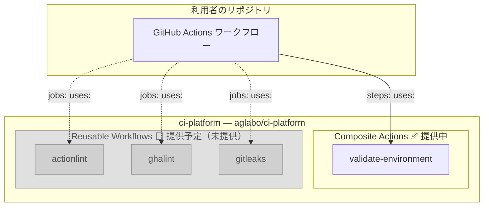

## 🏗️ ci-platform とは

`ci-platform` は、OSS の **CI/CD 品質管理を共通化・外部化するための基盤**です。
OSS メンテナーや開発者のために、GitHub Actions の Composite Actions や Reusable Workflows を公開しています。

自分のリポジトリのワークフローから、`aglabo/ci-platform` を指定して `uses:` で参照するだけで利用できます。

```yaml
- uses: aglabo/ci-platform/.github/actions/validate-environment@v0.1.0
```

---

## 🎯 解決する問題

OSS 開発では、CI/CD に関して次のような課題が生じやすいです。

- コミット時にシークレット情報や機密データを混入するリスクがある
- GitHub Actions ワークフローの設定ミスが CI 実行時まで発覚しない

`ci-platform` が公開する Actions やワークフローを参照することで、これらの問題に対処する CI/CD 品質管理の仕組みを**自分のリポジトリに取り込めます**。

## 📦 提供コンポーネント

### 現在提供中

<!-- markdownlint-disable line-length MD060 -->

| 種類             | コンポーネント       | レイヤー | 役割                                                             |
| ---------------- | -------------------- | -------- | ---------------------------------------------------------------- |
| Composite Action | validate-environment | 基盤入口 | GitHub Actions ランナーの OS・パーミッション・ツールを検証します |

<!-- markdownlint-enable line-length MD060 -->

### 提供予定 (Reusable Workflow)

<!-- markdownlint-disable line-length MD060 -->

| コンポーネント | 説明                                  |
| -------------- | ------------------------------------- |
| actionlint     | GitHub Actions ワークフローの構文検証 |
| ghalint        | GitHub Actions のポリシー違反検出     |
| gitleaks       | リポジトリ全体の機密情報スキャン      |

<!-- markdownlint-enable line-length MD060 -->

> 上記のツールは現在 ci-platform 自身の CI で使用しています。
> 将来的に reusable workflow として公開し、外部リポジトリから直接参照できるようにする予定です。

### 構成概観


```mermaid
graph TB
    subgraph repo["利用者のリポジトリ"]
        wf["GitHub Actions ワークフロー"]
    end

    subgraph platform["ci-platform  ―  aglabo/ci-platform"]
        subgraph ca["Composite Actions  ✅ 提供中"]
            ve["validate-environment"]
        end
        subgraph rw["Reusable Workflows  ⬜ 提供予定（未提供）"]
            al["actionlint"]
            gh["ghalint"]
            gl["gitleaks"]
        end
    end

    wf -->|"steps: uses:"| ve
    wf -.->|"jobs: uses:"| al
    wf -.->|"jobs: uses:"| gh
    wf -.->|"jobs: uses:"| gl

    classDef planned fill:#d0d0d0,stroke:#999,color:#555
    class al,gh,gl planned
    style rw fill:#e0e0e0,stroke:#aaa,color:#555
```

> 実線は現在提供中、点線は提供予定のコンポーネントです。

## 🔧 品質管理の 3 つの柱

OSS 開発における品質管理は、次の 3 つの領域に分けられます。

| 領域                 | 対象               | ci-platform での提供 |
| -------------------- | ------------------ | -------------------- |
| ローカル品質管理     | Git Hooks          | 対象外               |
| **CI/CD 品質管理**   | **GitHub Actions** | **提供中・提供予定** |
| ドキュメント品質管理 | textlint など      | 対象外               |

**ci-platform が提供するのは CI/CD 品質管理の領域のみです。**
CI/CD に責務を限定することで、ツールの肥大化を防ぎ、各リポジトリへの導入コストを最小化します。
ローカル品質管理やドキュメント品質管理のツールは、利用者が各自で導入してください。

### CI/CD 品質管理 (GitHub Actions)

(main ブランチへの)Push・PR 時に GitHub Actions が自動実行し、ワークフロー定義を検証します。
現在は ci-platform 自身の CI に組み込まれており、外部への reusable workflow 提供は予定中です。

| ツール     | 目的                                  | 外部提供 |
| ---------- | ------------------------------------- | -------- |
| actionlint | GitHub Actions ワークフローの構文検証 | 予定     |
| ghalint    | GitHub Actions のポリシー違反を検出   | 予定     |
| gitleaks   | リポジトリ全体のシークレットスキャン  | 予定     |

## 🚀 利用方法

自分のリポジトリの GitHub Actions ワークフローから Composite Actions を参照して利用します。
`ci-platform` のリポジトリ自体をフォークする必要はありません。

```yaml
jobs:
  build:
    runs-on: ubuntu-latest
    permissions:
      contents: read # validate-environment に必要な最小権限

    steps:
      - name: Validate environment
        uses: aglabo/ci-platform/.github/actions/validate-environment@v0.1.0
```

> 現在は **Linux ランナーのみをサポートしています**。
> Windows および macOS には未対応です (`ubuntu-latest`、`ubuntu-22.04` など Linux 系ランナーで使用してください)。

## 🗺️ ロードマップ

**v0.1.x 系 (現在)**: `validate-environment` Composite Action を提供中。GitHub Actions ランナーの OS・パーミッション・ツールを事前検証します。

**v0.2.x (予定)**: actionlint・ghalint・gitleaks を reusable workflow として集約し、外部リポジトリからワンラインで参照可能にします。
これにより、ワークフローの構文検証・ポリシー検証・機密情報スキャンを CI 基盤として標準化します。

```yaml
# 将来の利用イメージ
jobs:
  scan:
    uses: aglabo/ci-platform/.github/workflows/scan-gitleaks.yml@v1
```

---

## 📚 関連ドキュメント

- [使い方](./01-how-to-use.ja.md): 各種アクション・ワークフローの利用手順
- [Validate Environment 概要](./10-about-validate-environment.ja.md): validate-environment の詳細
- [クイックスタート](./11-quickstart.ja.md): 最小構成での利用手順
